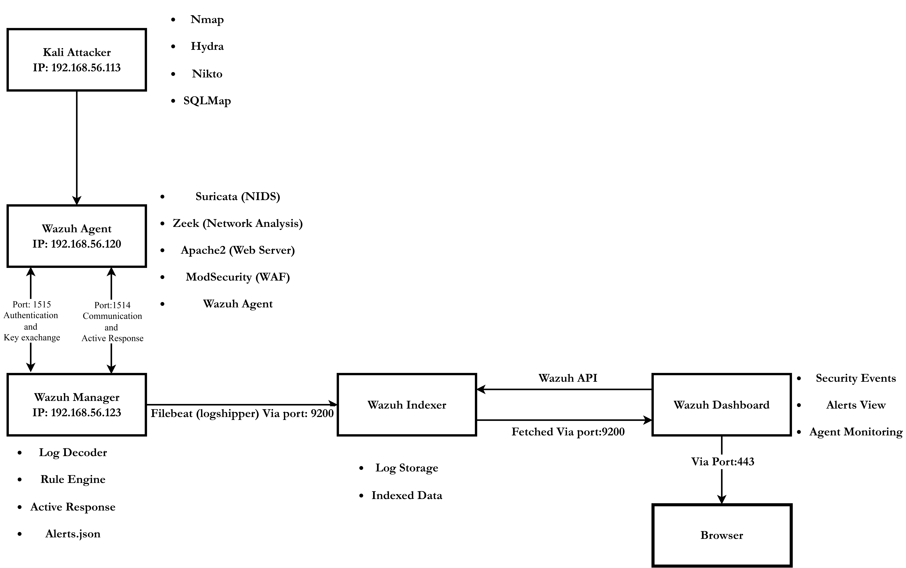

# SOC-Based Threat Detection and Incident Response Lab

## Project Introduction

This project demonstrates the implementation of a centralized Security Operations Center (SOC) lab using Wazuh SIEM. The lab simulates real-world cyber attacks in a controlled virtual environment and performs detection, analysis, and automated incident response.

The objective of this project is to understand how logs flow across systems, how attacks are detected at multiple layers, and how automated response mechanisms mitigate threats in real time.

---

## Virtual Machines and IP Configuration

The lab consists of three virtual machines configured in a host-only network.

| Machine        | Role                     | IP Address        |
|---------------|--------------------------|------------------|
| Kali Linux    | Attacker                 | 192.168.56.113   |
| Wazuh Agent   | Victim + Detection Node  | 192.168.56.120   |
| Wazuh Manager | SIEM Server              | 192.168.56.115   |

All machines are connected within the same subnet (192.168.56.0/24).

---

## Lab Architecture

The overall architecture of the SOC lab is shown below:

Data Flow:

Kali Linux → Wazuh Agent → Wazuh Manager → Wazuh Indexer → Wazuh Dashboard

- Port 1515 – Agent registration  
- Port 1514 – Encrypted log transmission  
- Port 9200 – Indexing  
- Port 443 – Dashboard access  

---

## Project Phases

### Phase 1 – Infrastructure Setup

- Configured three virtual machines in VirtualBox.
- Installed Wazuh Manager on the SIEM server.
- Installed and registered Wazuh Agent.
- Verified secure communication and active agent status.

---

### Phase 2 – Detection Layer Configuration

- Installed and configured Suricata for network intrusion detection.
- Deployed Zeek for network behavior analysis.
- Installed Apache web server.
- Enabled ModSecurity for web application firewall protection.
- Forwarded logs from Agent to Wazuh Manager.

---

### Phase 3 – Attack Simulation and Analysis

Simulated the following attacks from Kali Linux:

- Reconnaissance using Nmap
- SSH brute force using Hydra
- Web vulnerability scanning using Nikto
- SQL injection testing using SQLMap

Verified detection in Wazuh Dashboard and analyzed logs from multiple layers.

---

### Phase 4 – Automated Incident Response

- Configured Wazuh Active Response.
- Automatically blocked malicious IP addresses using firewall-drop.
- Verified iptables DROP rules on the Agent machine.
- Confirmed blocking event in the Wazuh Dashboard.

---

This project demonstrates a complete SOC workflow:

Detection → Analysis → Response
